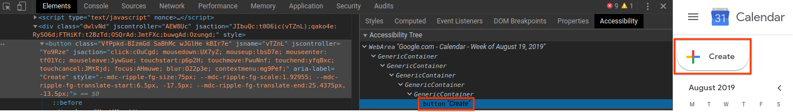
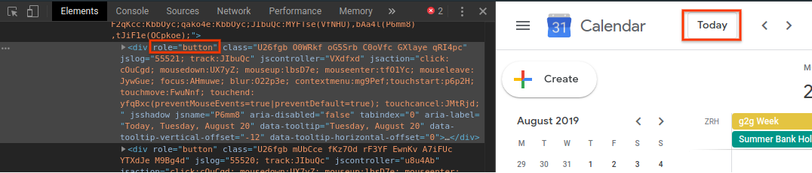
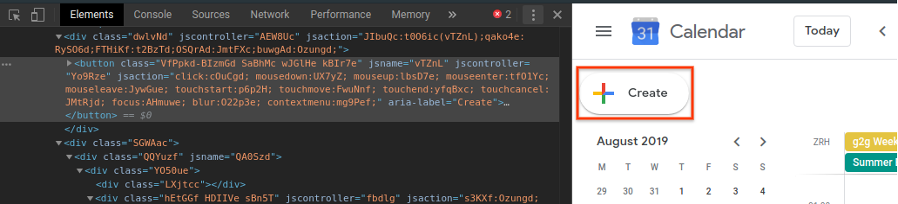
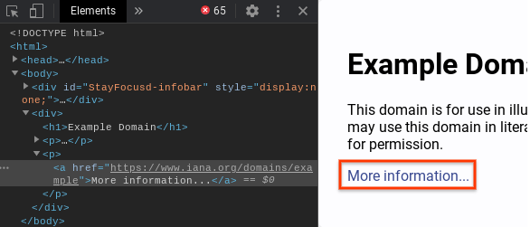
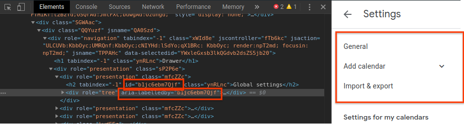
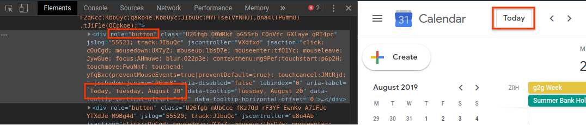

# Tutorial

This doc is a step-by-step guide to writing (or auto-generating) semantic
locators.

Semantic locators have one required part, the ARIA role, and two optional parts,
accessible name and ARIA attributes. The role and name are almost always enough
to identify elements.

In the locator `{button 'OK'}` the role is `button` and the accessible name is
`OK`.

## Chrome Extension

Coming soon - use a Chrome Extension to automatically generate Semantic Locators.

## Chrome Developer Console

The Accessibility tab of the developer console contains the accessibility tree
which can often provide semantic locators. Select the required element and check
the accessibility tree. In this case the element is `button "Create"` in the
accessibility tree, and the semantic locator is `{button 'Create'}`.

## Manually

If the above methods don't work, you can write semantic locators manually as
follows.

### Finding the role

#### Does the element have the `role` attribute?

If the element you want to locate has an explicit role then use that. The list
of roles can be found on
[MDN web docs](https://developer.mozilla.org/en-US/docs/Web/Accessibility/ARIA/ARIA_Techniques).

e.g. `{button 'Today*'}`:

#### Does the element have native semantics?

Many HTML tags have implicit semantics, for example `<button>` has the aria role
of `button`.

e.g. `{button 'Create'}`:

The role of an element isn't always the same as the tag name. For example the
`<a>` html tag has the role `link`. The full description of the implicit roles
given to native HTML can be found in the first 2 columns of
[this table](https://www.w3.org/TR/html-aria/#docconformance).

e.g. `{link 'More information...'}`:

#### Can you use an ancestor element instead?

If the element itself has no explicit or implicit semantics then you can select
an ancestor element (parent or grandparent or...). Sometimes selecting the ancestor
will be sufficient.

### Finding the value

#### Does the element have the `aria-label` attribute?

Then the label is your value.

e.g. `{button 'Create'}`:

#### Does the element have the `aria-labelledby` attribute?

Find the labelling element (ctrl+f in the Chrome developer console for the id).
Then follow these steps again to find a value for that element.

e.g. `{tree 'Global settings'}`

#### Does the element contain text?

You can use this text as the value if the role supports [name from content](https://www.w3.org/TR/wai-aria/#namefromcontent).

e.g. `{link 'More information...'}`:

#### Don't know exactly what the value will be? (Or value is very long)

Values accept `*` as a wildcard at the start and end (e.g. `'* view'` `'Calendar
name: *'`, `'*.google.com/*'`)

e.g. `{button 'Today*'}`:

#### Is a value necessary?

`{list}` is a valid locator if you know there's only going to be one list on the
page.

### That's not enough to uniquely identify the element

#### Outer

If you have nested elements which both match the same locator you can use the
`outer` keyword to match only one of them.

e.g. `outer {listitem}` will match the outer `li`, `{listitem} {listitem}` will
match the inner `li`

#### Attributes

To select a checked checkbox (checked either with native html `checked` or `aria-checked`), use `{checkbox 'Name' checked:true}`. The list of supported attributes can be found in `SUPPORTED_ATTRIBUTES` at [types.ts](../javascript/lib/types.ts).

#### Multiple Semantic Locator elements

Semantic locators can be combined, with later elements being descendants of
earlier elements.

e.g. `{listitem 'foo'} {listitem 'bar'}`

